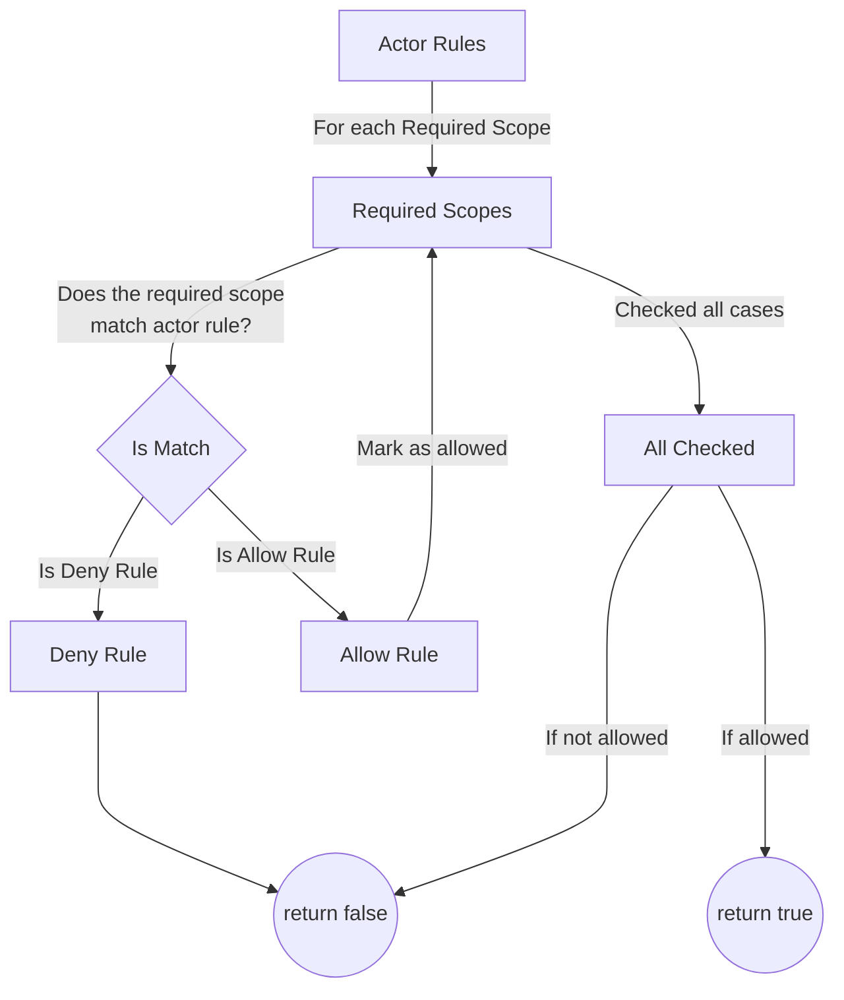

# Allow rules

Scopie flow works as a nested for loops iterating over the actor rules and required scopes.

## Matching

In order for a scope to match a rule it must have the same number of blocks,
and that every block matches.

```title="Mismatched Lengths"
required = "acme/accounts/edit"
actor    = "accounts/*"
            ^ actor has two levels while required has three
```

```title="Mismatched Block"
required = "acme/accounts/edit"
actor    = "acme/accounts/read"
                           ^ edit does not equal read
```

## Deny Break

If a scope matches a deny rule, we instantly return false.
We do not check until the end of our loops in this case.
If any error is present after the deny rule match, it will not be found or returned.

```title="Deny Break"
required = "accounts/edit"
actor    = "deny/accounts/*,allow/blogs/*"
           ^ matches      ^ skipped
```

## Allow skips

If an allow rule is matched early in the loops, we can skip trying to match any future
allow rules as we already matched one.
Thus, it is possible to not have errors returned if they are part of rules we effectively skipped.

```title="Allow Skip"
required = "accounts/edit"
actor    = "allow/accounts/*,allow/blogs/*"
            ^ matches      ^ skipped
```

## Flowchart



