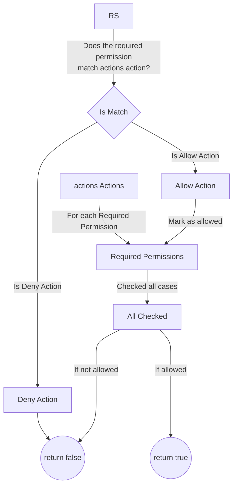

# Allow actions

Scopie flow works as a nested for loop iterating over the actions and permissions.

## Matching

In order for a permission to match a action it must have the same number of blocks,
and that every block matches.

```title="Mismatched Lengths"
permissions = ["acme/accounts/edit"]
actions  = ["allow/accounts/*"]
           ^ actions has two levels while required has three
```

```title="Mismatched Block"
permissions = ["acme/accounts/edit"]
actions  = ["allow/acme/accounts/read"]
                               ^ edit does not equal read
```

## Deny Break

If a permission matches a deny action, we instantly return false.
We do not check until the end of our loops in this case.
If any error is present after the deny action match, it will not be found or returned.

```title="Deny Break"
permissions = ["accounts/edit"]
actions  = ["deny/accounts/*","allow/blogs/*"]
                ^ matches    ^ skipped
```

## Allow skips

If an allow action is matched early in the loop, we can skip trying to match any future
allow actions as we already matched one.
Thus, it is possible to not have errors returned if they are part of actions we skipped.

```title="Allow Skip"
permissions = ["accounts/edit"]
actions  = ["allow/accounts/*","allow/blogs/*"]
           ^ matches          ^ skipped
```

## Flowchart



